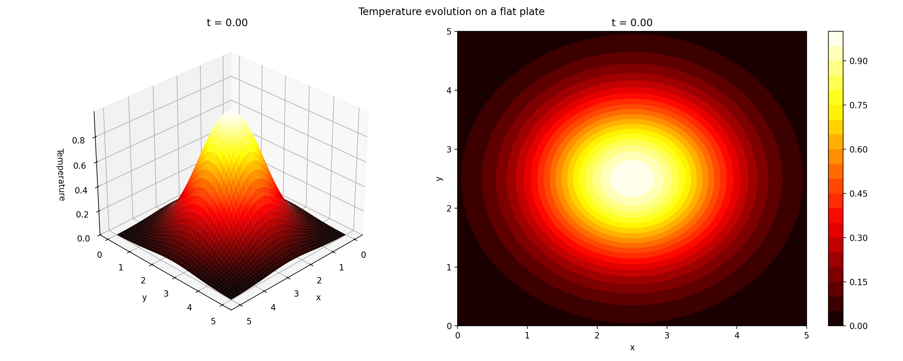

<div align="center">

# HeatWave
### A High-Performance Heat Equation Solver

[](https://www.python.org/downloads/)
[](https://github.com/google/jax)
[](https://opensource.org/licenses/GNU)



*Evolution of temperature distribution on a flat plate using the spectral method*

</div>

## 📝 Overview

HeatWave is a high-performance numerical solver for heat equations, leveraging JAX for GPU acceleration and automatic differentiation. This project demonstrates the practical application of numerical methods in computational physics using modern high-performance computing techniques.

### Simulation Parameters
- Gaussian initial condition
- Zero temperature boundary conditions
- Diffusion coefficient γ = 0.1
- Grid size: 50x50
- Time span: T = 30.0

## 🔥 Key Features

### Multiple Numerical Methods
- **Finite Difference Method (FDM)**
  - Explicit time-stepping scheme
  - Second-order central differences
  - Stability condition: CFL ≤ 0.5

- **Finite Element Method (FEM)**
  - Galerkin formulation
  - Linear elements
  - Mass and stiffness matrix assembly

- **Spectral Method**
  - Fast Fourier Transform (FFT) based
  - Exponential time differencing
  - Highly accurate for smooth solutions

### Performance Optimizations
- JAX-based implementation for GPU acceleration
- Vectorized operations for optimal performance
- Just-In-Time compilation

### Flexible Configuration
- YAML-based configuration system
- Customizable domain parameters
- Multiple initial condition types
- Adjustable boundary conditions

## 🧮 Mathematical Foundation

The 2D heat equation solved in this project is:

<div align="center">

$\frac{\partial u}{\partial t} = \alpha \left(\frac{\partial^2 u}{\partial x^2} + \frac{\partial^2 u}{\partial y^2}\right)$

</div>

where:
- $u(x, y, t)$ is the temperature
- $\alpha$ is the thermal diffusivity
- $t$ is time
- $x, y$ are spatial coordinates

<details>
<summary>📚 Detailed Mathematical Theory</summary>

A comprehensive mathematical analysis of the numerical methods used in this project can be found in `asset/theory_equation_heat_fr.pdf` (in French). This document covers:
- Detailed derivation of finite difference schemes
- Stability analysis of numerical methods
- Spectral method implementation
- Finite element formulation
- Error analysis and convergence studies

*Note: The theoretical documentation is available in French only.*
</details>

## 🚀 Getting Started

### Installation
```bash
# Clone the repository
git clone https://github.com/yourusername/heatwave.git
cd heatwave

# Install dependencies
pip install -r requirements.txt

# Install package in development mode
pip install -e .
```

The `-e` flag installs the package in "editable" or "development" mode, which means:
- Changes to the source code take effect immediately
- No need to reinstall after code changes
- Package is installed in your Python environment with references to the source code

### Usage
1. Configure simulation in `config/solver_config.yaml`:
```yaml
solver_type: "spectral"  # Options: spectral, finite_difference, finite_element
domain:
  Lx: 5.0
  Ly: 5.0
  T: 5.0
```

2. Run the example:
```bash
python examples/heat_equation_example.py
```

## 📁 Project Structure
```
heatwave/
├── config/
│   └── solver_config.yaml     # Configuration file
├── examples/
│   └── heat_equation_example.py
├── src/
│   ├── solvers/
│   │   ├── base_solver.py
│   │   ├── finite_difference.py
│   │   ├── finite_element.py
│   │   └── spectral.py
│   └── utils/
│       └── config.py
└── asset/
    └── report.pdf            # Detailed project report
```

## 🔄 Future Improvements
- Implementation of adaptive time-stepping
- Support for non-uniform grids
- Extension to 3D problems
- Integration of more boundary condition types

## 📜 License
This project is licensed under the GNU License - see the [LICENSE](LICENSE) file for details.

---
<div align="center">
<i>This project was developed as part of an engineering school curriculum.</i>
</div>